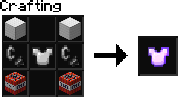

# jadbreaks Patch 1.0.0

## Jetpacks

* Hold `SHIFT` to accelerate upwards.
* Refuel your jetpack by right-clicking coal. 1 coal for 40 ticks (2 seconds) of flight.
* Absorbs all fall damage. (as long as it has fuel)

## Fancy One Player Sleep
* One player sleeping in a bed progresses the time to day, with a fancy animation to accompany it.
* The sleeper will be announced in chat.

## Pinging

* You can ping anyone in chat just like in Discord, by typing `@name`

## Death Persistence
* Dying no longer resets your health or hunger.
* Dying no longer drops your experience, it now persists after death.

## God Pets

* Taming an animal now makes them invulnerable any damage except player attack.
* Any tamed animal will have a high resistance to player damage.
* Right-clicking a tamed animal will tell you it's owner.

## Miscellaneous
* Mobs drop their experience orbs on death despite death reason.

## Conclusion
Many, many more features are coming; most of them are already done, but not in the server yet.

Tune into the server (hopefully) every friday for a new patch.

Look at `#previews` in the Discord for sneak peeks.
