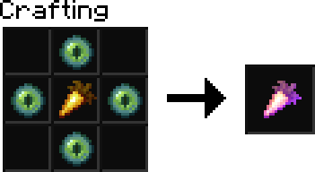

# jadbreaks Patch 1.1.0

## Perks
* Perks are new custom items that you can craft and consume to grant you special abilities.
* New abilities will be added over time.
* Currently, the only ability is...

## Warper

* Consuming the warper perk gives you access to the `/warp` command.
* You can set a warp to where you're standing with `/warp set <name>`
* You can teleport to a warp with `/warp to <name>`
* You can delete warps you've created with `/warp delete <name>`
* Taking damage (excluding fall damage) will prevent you from warping for a minute.

## Jetpack Changes
* Jetpacks no longer absorb all fall damage.
* Jetpacks now reduce fall damage by 25%
