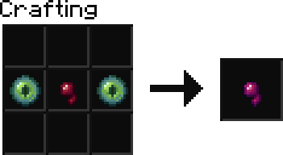

# jadbreaks Patch 1.1.1

## Warper Changes

* The warper perk's recipe has been reduced in cost.

## Death Location Help

* When you die, the location of your death is easily accessible.
* Your death location is displayed in chat when you respawn.
* You can display your death location with the command `/died`

## Server List

* The description of the server in the server list has been given a face lift.

## Jihad

* The `/jihad` command has been overhauled.
  * It now has more particles effects.
  * It now correctly states that you blew up in chat.
  * The explosion is now real. This means you can damage nearby mobs with it.

## Death Saving
* Health and hunger retention on death has been disabled. This was made with keep inventory in mind, which is not relevant to our server.
* You will now keep your inventory if your death was because of direct player attack.
  * Please note that you can still lose your items if a player puts you in a fatal scenario. (fire, fall, explosion, etc.)

## Fancy One Player Sleep
* This is no longer fancy. Sleeping will instantly progress the time to day.
* In the future I will try to make it so phantoms don't attack you, but currently they will attack you despite sleeping often.

## More features!
* I changed more than this, but I don't remember. Enjoy. :)
